# Introduction

This repo contains my first exploration of sentiment analysis with R.
I drew inspiration from the awesome (and freely available!) e-book
*[Text Mining with R](https://www.tidytextmining.com/)*,
co-authored by David Robinson and Julia Silge. In araddition,
I drew upon Julia's [Ten Thousand Tweets](https://juliasilge.com/blog/ten-thousand-tweets/) and
[Joy to the World](https://juliasilge.com/blog/joy-to-the-world/)
blog posts, as well as David's highly publicized
[Analysis of Trump Tweets](http://varianceexplained.org/r/trump-tweets/) blog post.

# Description

For my own analysis,
I wrote a "dynamic" script that can be used to compare the pre-downloaded Twitter timelines of
any two individuals. (Thanks to Mike Kearney for the wonderful `rtweet` package!)
The script acts like a paramterized .Rmd file that generates HTML and pdf files directly via the `rmarkdown::render()` function.

I extracted Twitter data for three sets of individuals:

1. Myself (@TonyElHabr) and my twin brother (@elhabro);
2. The hosts of the popular sports-comedy podcast -- Dan "Big Cat" Katz (@BarStoolBigCat) and the anonymous PFT Commenter (@PFTCommenter);
3. Famoust sports-show prognositcators/hot take artists, Skip Bayless (@RealSkipBayless)
and Stephen A. Smith (@stephenasmith).

The full reports can be found in the `output` directory in this repo.

# Highlights

This is a summary of my biggest take-aways from my analysis. I highlight most
(but not all) of the different kinds of plots available in each full report.

## Tweet Volume

Despite being twins, the Twitter timelines of my brother and I tell relatively
different stories about us. It is clear that he is much more active than me.
The fact that he created an account well before me is the first indication of this.

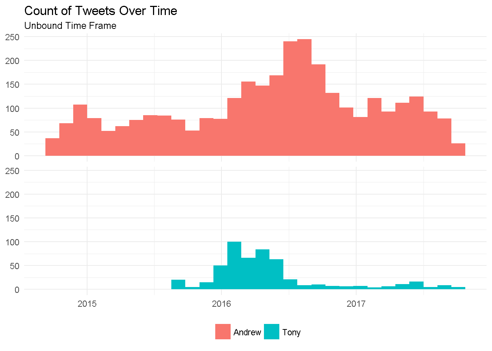

But, even when comparing our tweet volume across fixed time frames, it's still clear that
he is much more active than me.

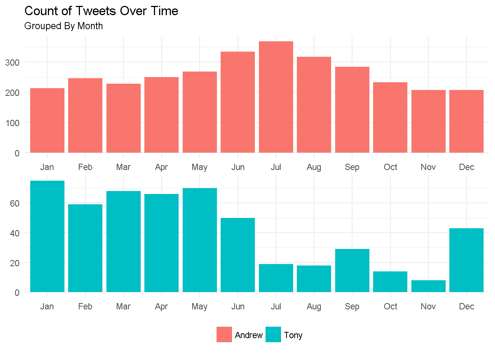

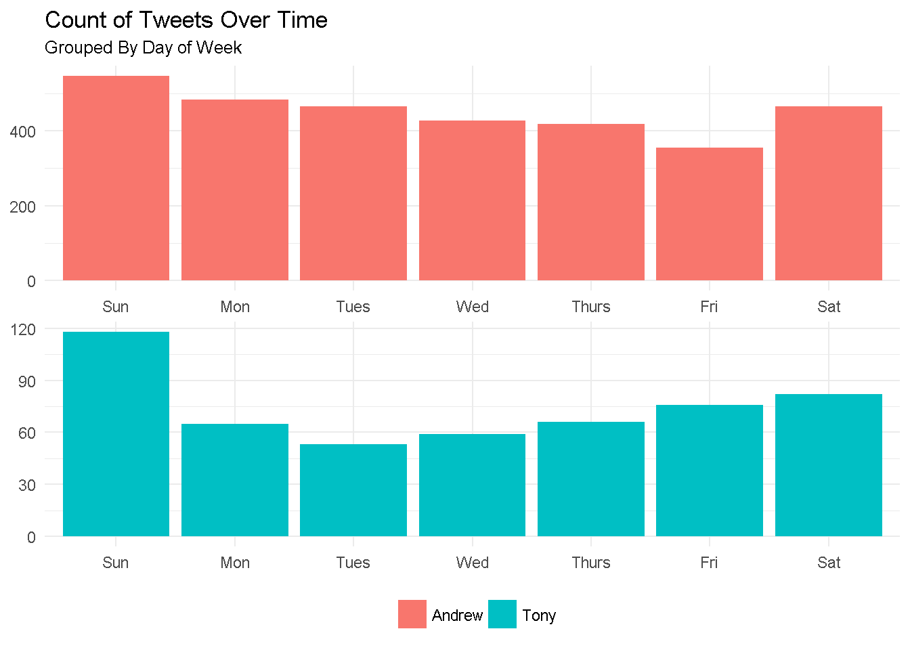

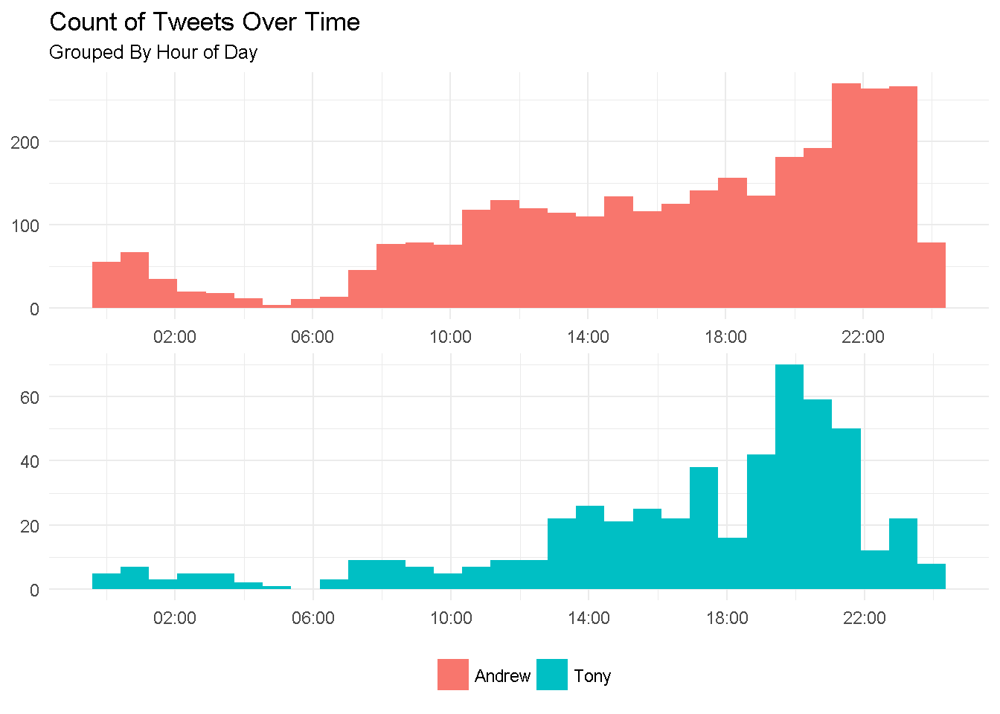

## Tweet Content and Popularity

The "behavior" of Bayless and Smith on Twitter is particularly interesting.
(And, if you're familiar with these larger-than-life personalities, perhaps
it isn't so suprising.)

Both loud-mouths stretch the extent of the character limit per tweet. (Note: This was
before the 280 character limit was implemented.) The same was not true for the other
sets of tweeters that I evaluated.

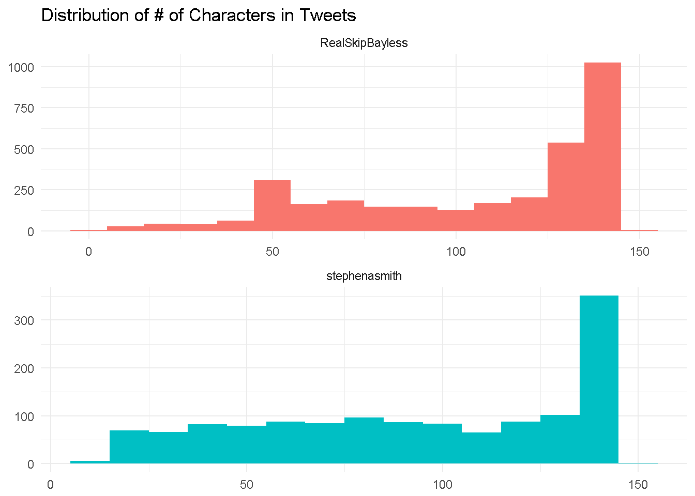

The frequency of words used by the two speaks to their involvment in sports narration.
Moreover, the specific words highlights some of the things that each character
is well known for--Skip is
all about the Cowboys, Spurs and Lebron James, and Stephen A. is all about talking smack
(no matter what the context).

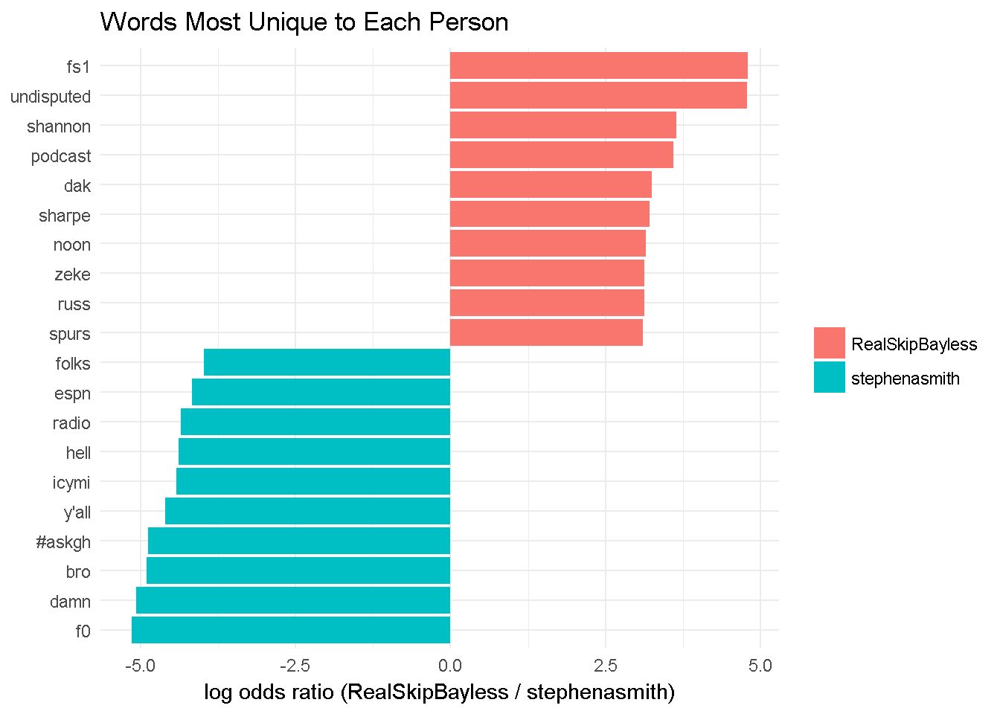

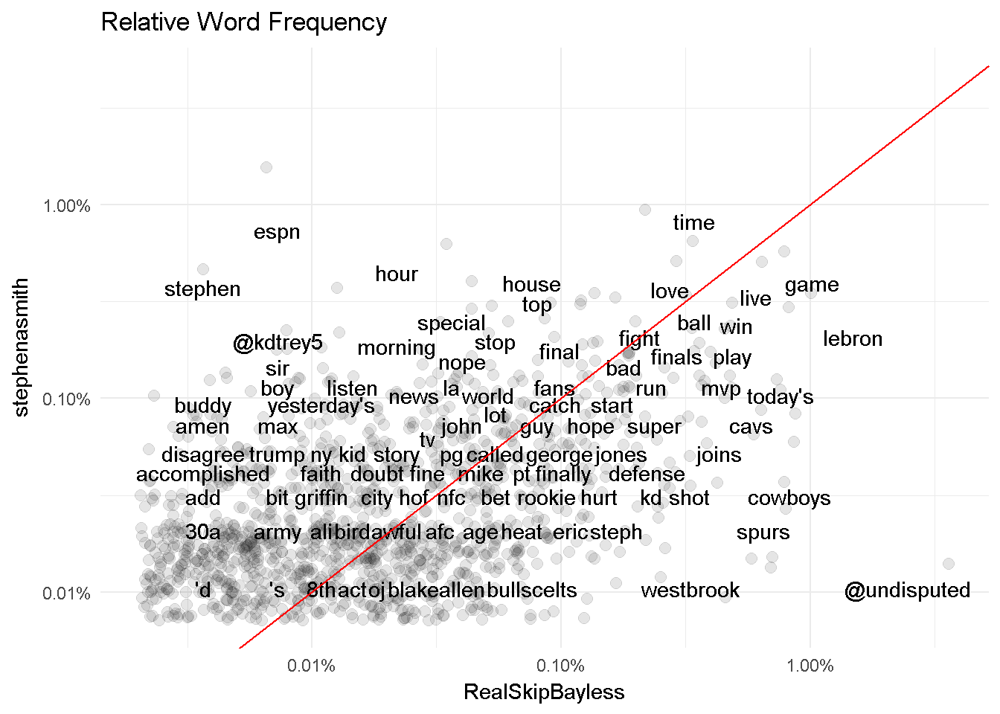

The way that sports debat can change on a daily basis is exhibit by the rise and 
fall of mentions of Conor McGreggor and Floydd Mayweathor (two extremely famous
fighters who squared off in a boxing match at the end of 2017) by Skip and Stephen A.

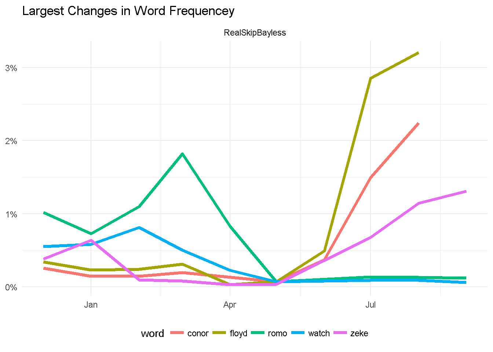

## Sentiment Analysis

Among the three reports, the highly divergent tone of the tweets
by PFT Commenter and Big Cat really stood out. It is clear 
(from a Poisson test of log odds ratio) that Big Cat is
much more negative than his podcat partner (at least on Twitter).

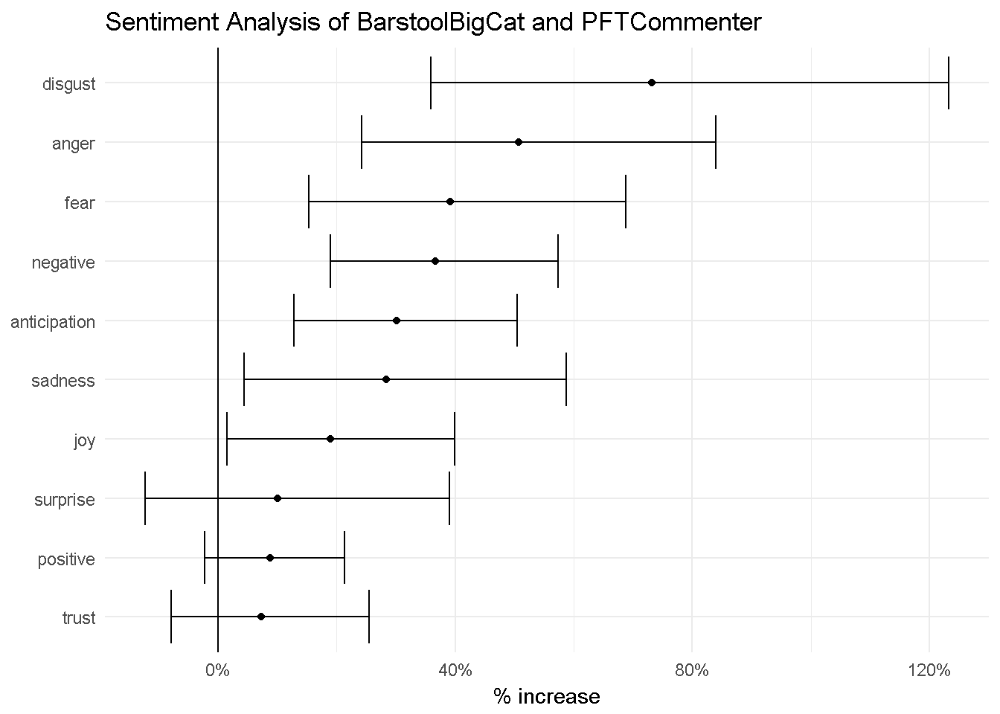

The plot for words contributing to sentiment differences is dominated by Big Cat's
negativity!

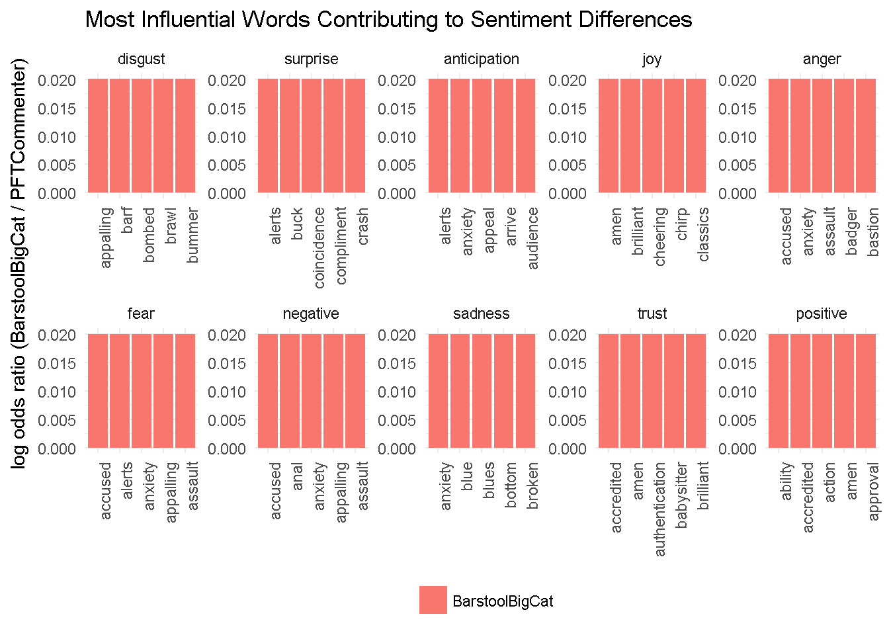

For comparison's sake, here is what the same plot looks like for me and my brother.

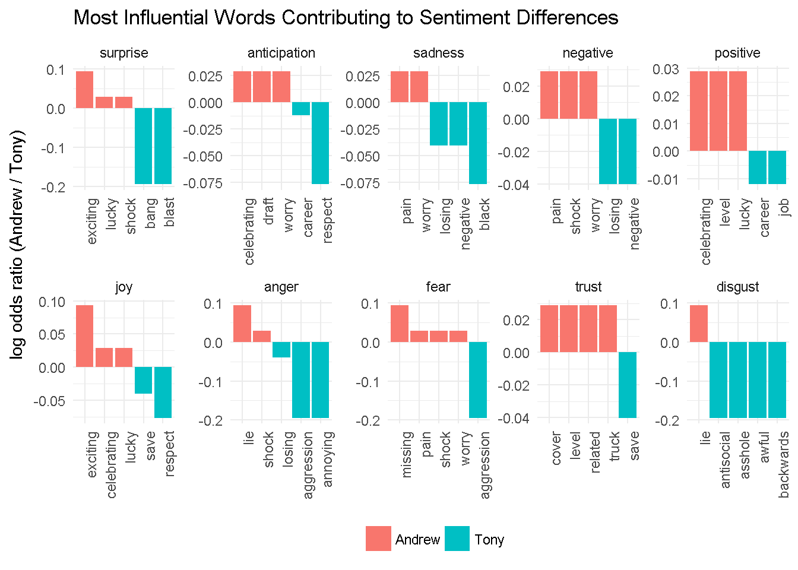

Check out the full reports for more details!

